# Documentación del back-office

## Resumen

Este es el back-office/dashboard/admin panel de Spotifiuby y sus diferentes servicios. Este cuenta con diferentes páginas que nos permiten controlar el sistema. Podremos contar con las herramientas necesarias para ver el contenido que a los que los usuarios tienen acceso y también al que no, ver los usuarios y su rol en el sistema, bloquear su acceso al mismo, así como crear nuevos administradores. Por otro lado ver métricas, servicios (API keys),listar transacciones.
Está intencionado unicamente para los administradores del sistema.

Para el desarrollo de ésta página web fue utilizado React en javascript, utilizando la biblioteca Material UI ([MUI](https://mui.com/)) y de template base se uso uno de los que provee la biblioteca de manera gratuita, [Minimal – Client & Admin Dashboard
.](https://mui.com/store/items/minimal-dashboard-free/)

---

## Login

---

- Únicamente se podrá ingresar con un usuario con credenciales de administrador
- Snackbar para mostrar errores o cuando se ingresa correctamente
- Validación de campos (formato mail y largos mínimos)
- Botón con estado cargando

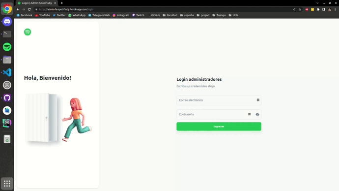

---

## Contenido

---

Por default se observa la categoría albums, en cualquier estado (activo e inactivo) y cualquier género.

Para poder ver mas información de cualquier contenido se puede hacer doble click sobre la carta, un click sobre el titulo o presionar el botón del ojo.
También contamos con la posibilidad de bloquear/activar el contenido apretando el botón que cambiará su icono según el estado y con un indicador del estado en forma de circulo rojo (bloqueado) o verde (activo).

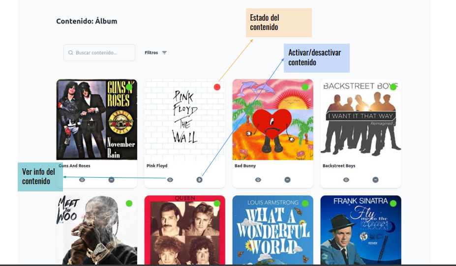

En la información podremos ver los datos esenciales y, para albums y playlists, podremos ver las canciones que las componen
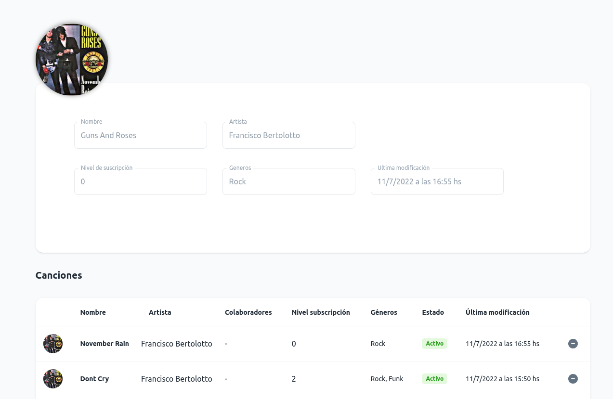

### Filtros

Su puede usar el buscador para filtrar por el nombre del contenido o desplegar la barra lateral de filtros.

- Álbum: Se mostrarán todos los albums del sistema
- Estado: Se mostrará todo el contenido del estado elegido en la categoría actual
- Género: Se mostrará todo el contenido que contenga uno o más de los géneros elegidos en la categoría actual
- El botón de limpiar todo quitará todos los filtros actualmente usados pero manteniendo la categoría

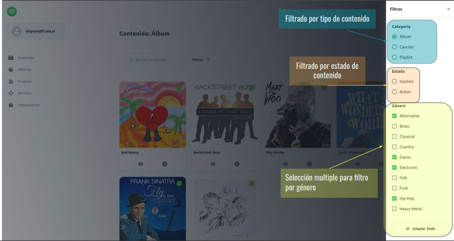

---

## Usuarios

---

Se listan todos los usuarios del sistema, se puede ver su información y crear un nuevo administrador.
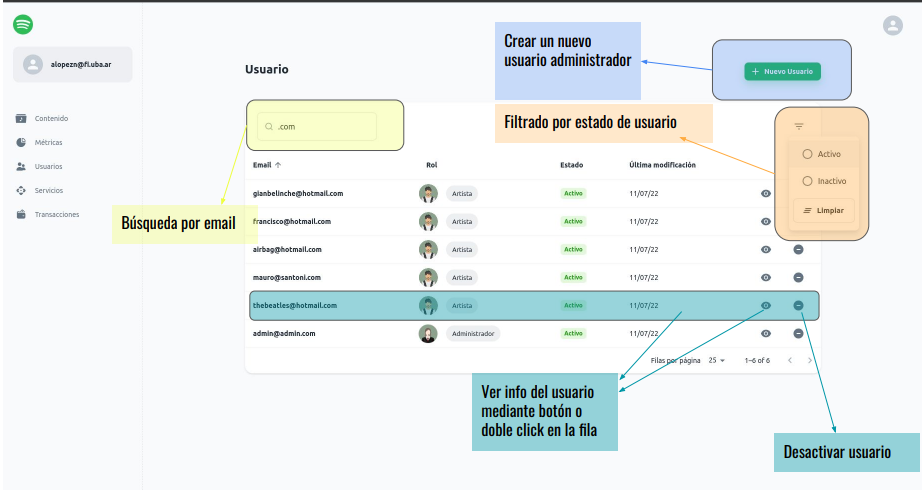

Para crear un nuevo administrador se deberá completar todo el formulario y unos requisitos mínimos:

- Primer nombre (largo entre 2 y 50 caracteres)
- Segundo nombre (largo entre 2 y 50 caracteres)
- Email (se valida que sea un mail válido)
- Contraseña (largo entre 6 y 25 caracteres)
- Ubicación (se obtienen de la base de datos)
- Géneros (se obtienen de la base de datos y son de selección multiple)

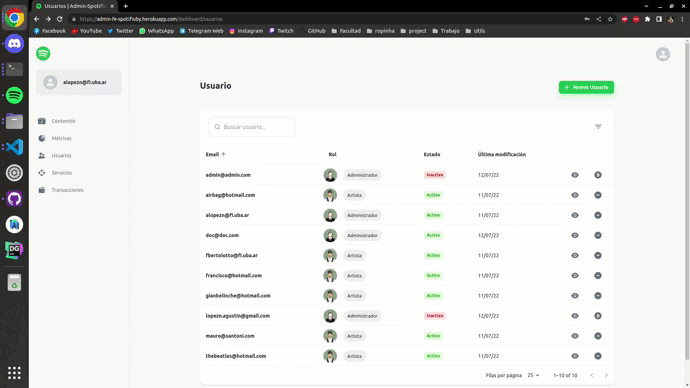
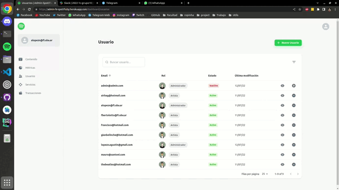

---

## Metricas

---

Se podrán las métricas de los usuarios:

- Cantidad de reseteos
- Cantidad de bloqueos
- Cantidad de ingresos (Mail o Google)
- Cantidad de nuevos usuarios (registro por mail o por google)

Se cuenta con un selector de fecha para elegir el día desde donde se quieren ver los datos, el default es desde el día actual.
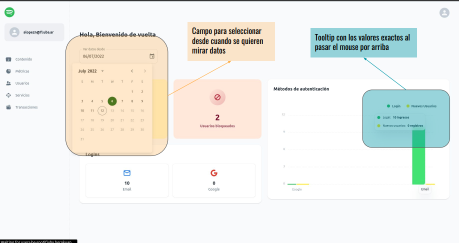
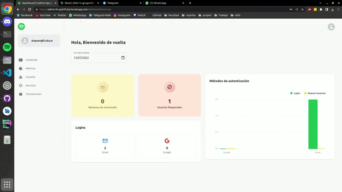

---

## Servicios

---

Al igual que otras páginas se permite filtrado por estado, búsqueda, ver los datos del servicio, bloquearlo y dar de alta.
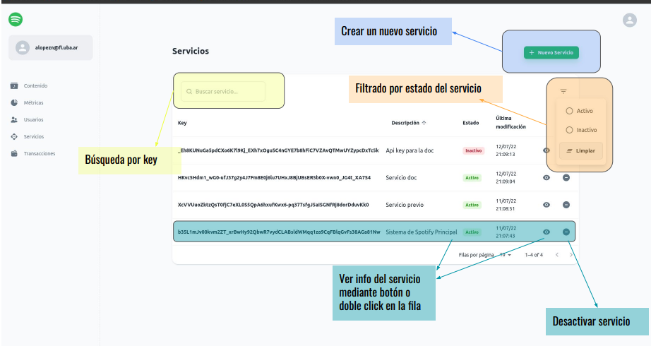

Para crear una nueva API Key deberemos ingresar unicamente la descripción/nombre que se le quiere asignar a este servicio.
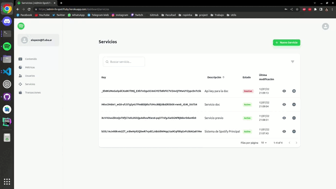

---

## Transacciones

---

Se listan las transacciones realizadas en el sistema con datos como el hash de la transacciones, hash de usuario que envío y el que recibió, monto, entre otros datos

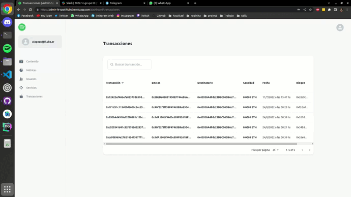
