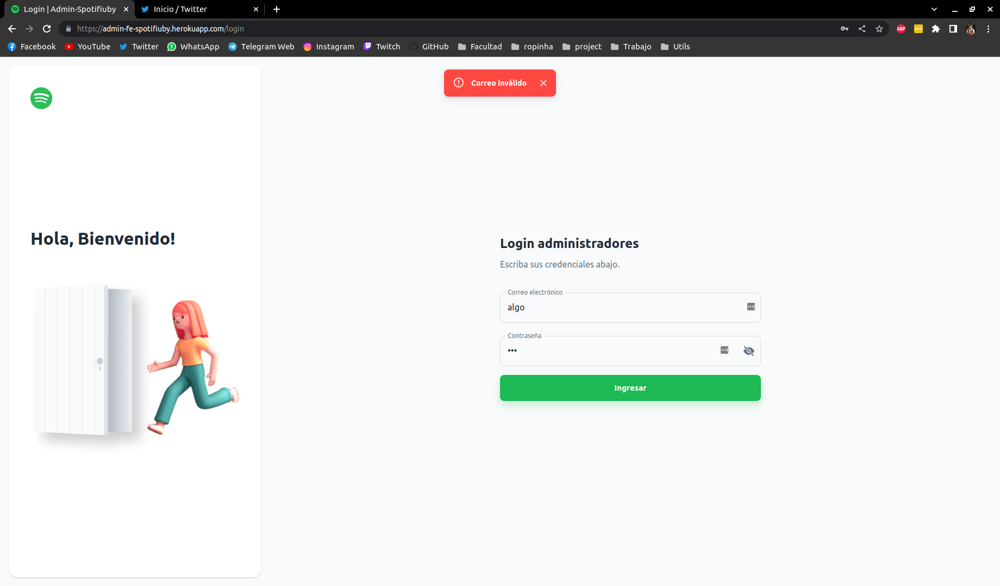

# Documentación del back-office

--------------------------------
## Login
--------------------------------

--------------------------------

## Contenido
--------------------------------

### Filtros

* Álbum: Se mostrarán todos los albums del sistema
* Estado: Se mostrará todo el contenido del estado elegido en la categoría actual
* Género: Se mostrará todo el contenido que contenga uno o más de los géneros elegidos en la categoría actual

--------------------------------
## Metricas

--------------------------------

--------------------------------

## Servicios
--------------------------------

--------------------------------
## Usuarios
--------------------------------
