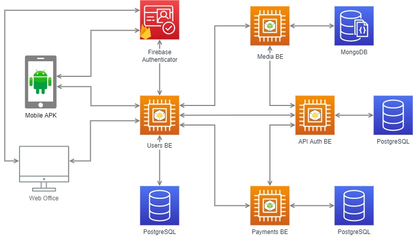
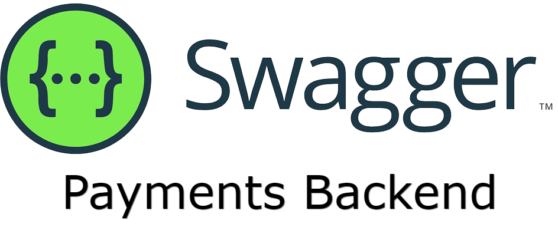

# Arquitectura

## Diseño - Arquitectura

El desarrollo de la aplicación comenzó planteándose y dividendo la organización en tres grandes frentes: Mobile, Backend y Frontend (Backoffice).

A continuación podemos observar el diagrama de arquitectura de los servicios de la aplicación.

---

## Backend

Inicialmente, el backend comenzó con el diagramado básico de servicios requeridos para poder llevar a cabo la aplicación de forma ordenada.
Es asi como se opto por tener centralizada la comunicación principal de la aplicación en un solo servicio `users-be`, y que éste se encargase de la comunicación con tanto el _Backoffice_ como con la aplicación _Mobile_.
Esto derivó en que se utilice el patrón de arquitectura Backend for Frontend, de forma que `users-be` toma requests y se encarga de generar la respuesta a partir de los demás backends.

Al comienzo se partió del uso de `users-be` y `media-be`, a los que luego se les sumó el uso de `payments-be` y `api-be`.

### `Users BE`

Aquí sucede la comunicación principal entre backend y frontend. Tiene la lógica necesaria en cuanto a lo relacionado con los usuarios (y sus transacciones), roles, etc y ademas es la puerta de enlace con los demas servicios, por ende toda las requests pasaran por aquí.

Se realizó en Python con Flask como framework de desarrollo, junto a `flask_restx` para la documentación de la API REST. Para el manejo de la base de datos se utilizó PostgreSQL (relacional).

Tanto este servicio como todos los demás se encuentran dockerizados para su deploy y poseen una base de datos dentro del proceso de test en Docker, de forma que cualquier ejecución es completamente aislada e independiente del entorno.

### `Media BE`

Este servicio tiene la finalidad de almacenar toda la lógica y datos relacionados con el contenido multimedia de la aplicación.
Se realizó con Node.js y Express.js como framework de desarrollo, junto a una base de datos en MongoDB (no relacional).
Aquí se almacenan todos los datos de canciones, álbumes, artistas, playlists, etc.

### `Payments BE`

El servicio tiene la finalidad de manejar la comunicación con el Smart Contract y la red Ethereum con el objetivo de poder realizar transacciones. El servicio de pagos fue realizado en Node.js con Fastify como framework y con base de datos en PostgreSQL (relacional). Se almacenan objetos como las transacciones, las billeteras, etc.

### `API BE`

Este servicio fue el último en ser agregado, y es vital para la seguridad de la aplicación permitiendo el uso de `api keys` y el agregado de servicios.

Se realizó en Python con Flask como framework de desarrollo, junto a `flask_restx` para la documentación de la API REST. Para el manejo de la base de datos se utilizó PostgreSQL (relacional).

El servicio de `users-be` utiliza a `api-be` mediante una _api key_ privada del sistema para realizar cualquier request a los backends de `media-be` y `payments-be`.

---

## Servicios Externos

### `Firebase`

Se utilizó _Firebase_, una plataforma para el desarrollo de aplicaciones web que facilitó la autenticación (`Firebase Authentication`) de los usuarios a partir de un mail y el proveedor de identidad federada, que en nuestro caso fue Google para facilitar el registro de nuestros usuarios.
Esta herramienta también permitió el manejo de contenido multimedia, guardando imágenes y canciones de forma rápida y segura mediante `Firebase Storage`.

Finalmente, se utilizó `Firebase Realtime Database` para el almacenado y visualización de chats de Mobile.

### `Expo`

Se utilizó `expo` para poder notificar sobre nuevos mensajes a los usuarios y también para informar que un usuario agregó como colaborador de una Playlist a otro.

Estas notificaciones son enviadas desde `users-be` a los usuarios mediante una _push notification_.

---

## API REST

---

## Cobertura de tests (backend)

---