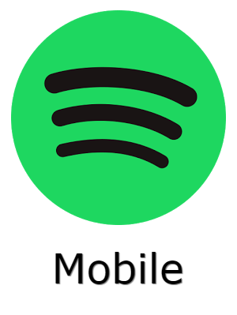
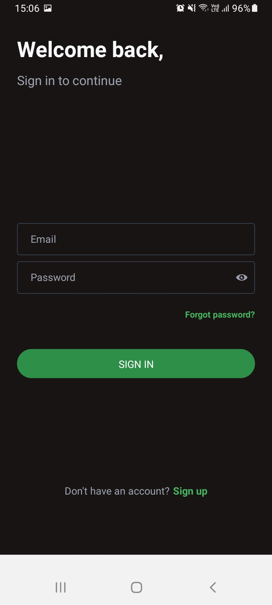

# Documentación de la aplicación mobile

## Resumen

Esta es la aplicación principal de Spotifiuby, desarrollada para android. Esta cuenta con diferentes pantallas que nos permiten interactuar con la aplicación. Se pueden crear albunes, playlists y canciones, asi como escucharlas y buscarlas. También posee un sistema de suscripción con 4 tiers, que puede ser pagado a través de Ethereum. Se puede enviar mensajes a otros usuarios de la plataforma.

Para el desarrollo de ésta aplicación fue utilizado ReactNative en javascript, utilizando la biblioteca NativeBase ([NB](https://nativebase.io/)), y expo como proveedor de la aplicación, asi también como herramienta de exportación al formato apk ([EXPO](https://docs.expo.dev/))

---

## Registro

---

- Para registrarse es necesario proveer distintos datos, estos son, el nombre completo, email, contraseña, locación y generos de interes
- Snackbar para mostrar errores/cuando se ingresa correctamente
- Validación de campos (formato mail, contraseña segura, campos requeridos)
- Botón con estado cargando

---

## Login

---

- Únicamente se podrá ingresar con un usuario ya registrado, utilizando su email y contraseña
- Snackbar para mostrar errores/cuando se ingresa correctamente
- Botón con estado cargando

---

## Recupero de contraseña

---

- En caso de olvidarse la contraseña es posible recuperarla, indicando el email asociado se enviará un email a esa casilla.
- Snackbar para mostrar errores/cuando se ingresa correctamente

---

## Home

---

- Es la pantalla principal de la aplicación, se muestran albunes, canciones y playlists recomendadas basadas en la locación y géneros elegidos al registrarse.
- Hay también un botón que lleva a la pantalla de notificaciones.
- Se puede observar la nav bar inferior para navegar a otras pantallas

---

## Buscador

---

- Un buscador de canciones y artistas, posee cuatro formas de buscar, ya sea por el nombre de la cancion, el nombre del artista, el género o el tipo de suscripción.

- Al deslizar una canción esta se agrega a la queue, y al deslizar un artista se va a su perfil

---

## Reproductor

---

- Pantalla en la que pueden reproducirse canciones
- Se puede pausar, adelantar, atrasar, dar play, ir a la proxima cancion, ir a la anterior y acceder a la cola de canciones

---

## Cola de canciones

---

- Se pueden observar las proximas canciones a reproducir

---

## Library

---

- En esta pantalla se pueden ver los albunes, canciones y playlist del usuario.
- Se pueden agregar nuevas canciones, albunes y playlist dando click al boton correspondiente.
- Al hacer click en un album o playlist lleva a la pantalla del mismo.
- Al hacer click en una cancion se reproduce

---

## Album

---

- En esta pantalla se puede ver el contenido de un album

---

## Playlist

---

- En esta pantalla se puede ver el contenido de una playlist

---

## Creación de album

---

- Aqui se crea un nuevo album
- Se deben proporcionar datos como, nombre, descripcion, generos, tipo de suscription y una imagen.

---

## Creación de canción

---

- Aqui se crea una nueva canción
- Se deben proporcionar datos como, nombre, generos, tipo de suscription, album, el propio archivo de la cancion y los colaboradores que se deseen añadir.

---

## Creación de playlist

---

- Aqui se crea una nueva playlist
- Se deben proporcionar datos como, nombre, descripcion, lista de canciones y de colaboradores.

---

## Perfil del usuario

---

- En esta pantalla se puede observar el perfil del usuario
- Hay una lista de los albums y playlists que posee, y al hacerles click se pueden editar
- Hay un boton para acceder a la billetera del usuario, otro para ver su suscripción, otro para editar el perfil y por ultimo un boton para desloguearse

---

## Editar album

---

- Al hacerle click a un album en el perfil se puede acceder a la pantalla para editarlo

---

## Editar playlist

---

- Al hacerle click a una playlist en el perfil se puede acceder a la pantalla para editarla

---

## Billetera

---

- Al hacerle click al boton de la billetera en el perfil se accede a la información de esta
- Se puede ver el balance y la dirección, la cual puede ser copiada

---

## Suscripción

---

- Al hacerle click al boton de suscripcion en el perfil se accede a la información de este
- Se puede ver el tipo de suscripcion actual y elegir un nuevo tipo de suscripcion

---

## Editar perfil

---

- Al hacerle click al boton de editar perfil, se puede cambiar el nombre y eliminar albunes, canciones y playlists.

---

## Perfil del artista

---

- Al deslizar un artista en el buscador se puede acceder al perfil de este
- Aqui se verán sus albunes y playlists, y hay un boton para enviarle un mensaje

---

## Lista de chats

---

- En esta pantalla se tiene un buscador de chats

---

## Chat

---

- Luego de elegir un usuario con el que hablar, se puede ver la pantalla del chat

---

## Notificaciones

---

- Al recibir un mensaje o ser añadido como colaborador a una playlist llegará una notificación a la app

